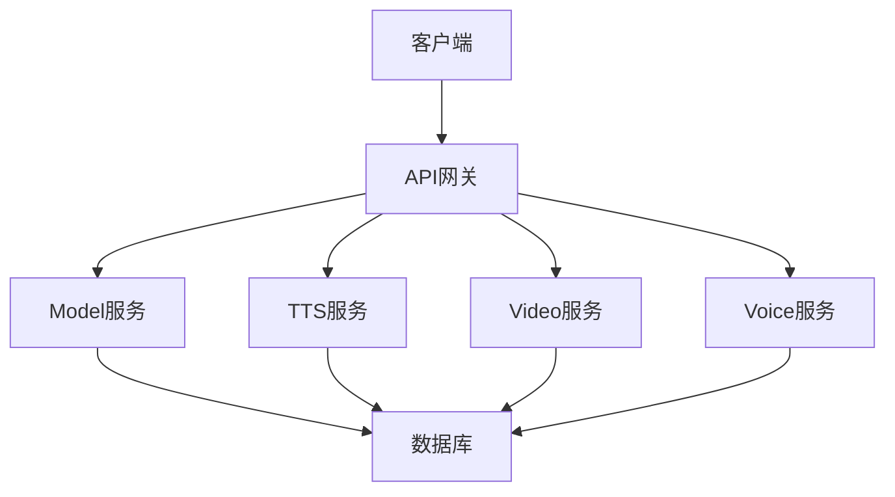

# 系统架构分析

## 整体架构图

## 分层架构
1. **API层** (api/)
   - 定义RESTful接口规范
   - 版本控制(v1/)
   - 输入参数验证

2. **控制层** (internal/controller/)
   - 处理HTTP请求
   - 参数解析
   - 响应格式化

3. **逻辑层** (internal/logic/)
   - 核心业务逻辑
   - 服务组合
   - 事务管理

4. **数据访问层** (internal/dao/)
   - 数据库操作
   - 缓存处理
   - ORM映射

5. **模型层** (internal/model/)
   - 数据结构定义
   - 输入/输出模型
   - 数据库实体

## 核心流程
1. 客户端请求 -> API网关 -> 路由分发
2. 控制器接收请求 -> 参数验证 -> 调用逻辑层
3. 逻辑层处理业务 -> 调用数据访问层
4. 数据访问层操作数据库 -> 返回结果
5. 逻辑层组装结果 -> 控制器返回响应

## 关键技术
- 使用Go标准库net/http处理HTTP请求
- 分层架构实现关注点分离
- 使用Makefile管理构建流程
- 支持Docker和Kubernetes部署
- 配置中心化管理(manifest/config/)
